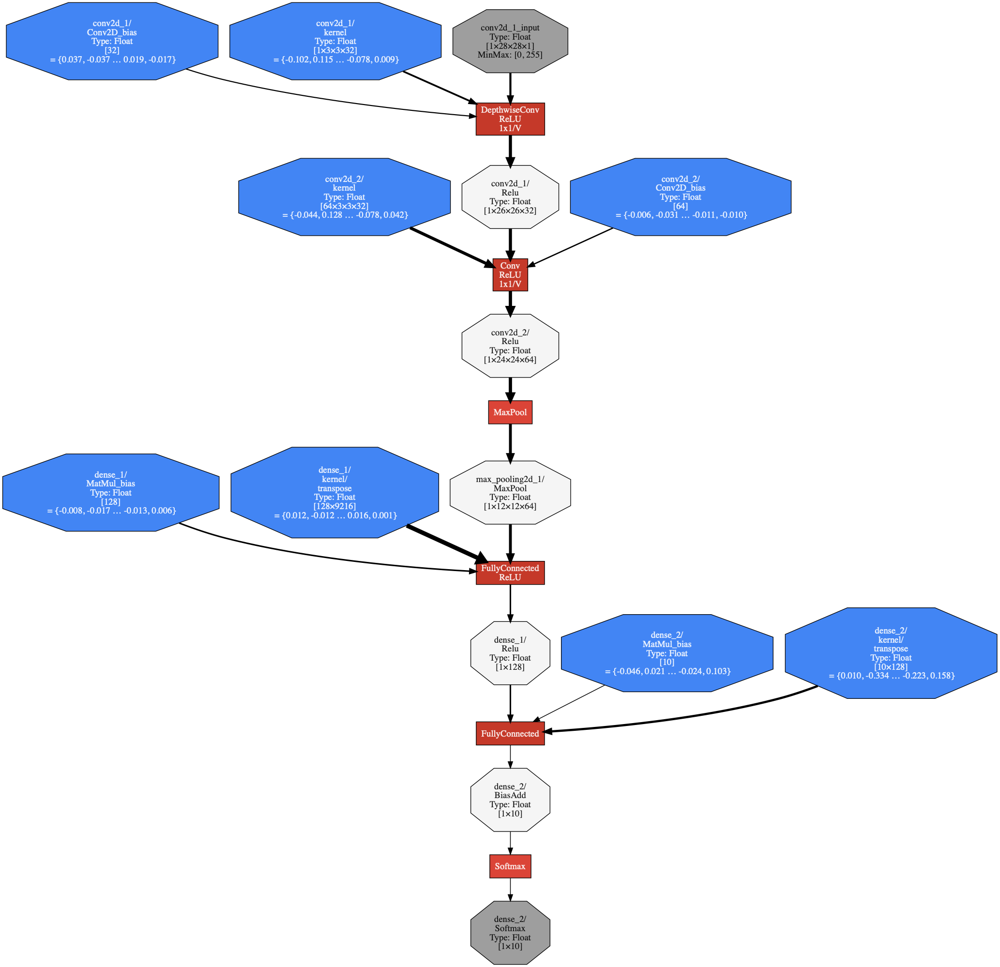

TensorFlow模型部署
==========================

模型的导出
^^^^^^^^^^^^^^^^^^^^^^^^^^^^^^^^^^^^^^^^^^^^

SavedModel
--------------------------------------------
TODO: 2.0 eager + Keras Sequential save model way

Keras Sequential save方法
--------------------------------------------

我们以keras模型训练和保存为例进行讲解，如下是keras官方的mnist模型训练样例。

源码地址::
    
    https://github.com/keras-team/keras/blob/master/examples/mnist_cnn.py

引用源码如下

.. code-block:: python

    '''Trains a simple convnet on the MNIST dataset.
    
    Gets to 99.25% test accuracy after 12 epochs
    (there is still a lot of margin for parameter tuning).
    16 seconds per epoch on a GRID K520 GPU.
    '''
    
    from __future__ import print_function
    import keras
    from keras.datasets import mnist
    from keras.models import Sequential
    from keras.layers import Dense, Dropout, Flatten
    from keras.layers import Conv2D, MaxPooling2D
    from keras import backend as K
    
    batch_size = 128
    num_classes = 10
    epochs = 12
    
    # input image dimensions
    img_rows, img_cols = 28, 28
    
    # the data, split between train and test sets
    (x_train, y_train), (x_test, y_test) = mnist.load_data()
    
    if K.image_data_format() == 'channels_first':
        x_train = x_train.reshape(x_train.shape[0], 1, img_rows, img_cols)
        x_test = x_test.reshape(x_test.shape[0], 1, img_rows, img_cols)
        input_shape = (1, img_rows, img_cols)
    else:
        x_train = x_train.reshape(x_train.shape[0], img_rows, img_cols, 1)
        x_test = x_test.reshape(x_test.shape[0], img_rows, img_cols, 1)
        input_shape = (img_rows, img_cols, 1)
    
    x_train = x_train.astype('float32')
    x_test = x_test.astype('float32')
    x_train /= 255
    x_test /= 255
    print('x_train shape:', x_train.shape)
    print(x_train.shape[0], 'train samples')
    print(x_test.shape[0], 'test samples')
    
    # convert class vectors to binary class matrices
    y_train = keras.utils.to_categorical(y_train, num_classes)
    y_test = keras.utils.to_categorical(y_test, num_classes)
    
    model = Sequential()
    model.add(Conv2D(32, kernel_size=(3, 3),
                     activation='relu',
                     input_shape=input_shape))
    model.add(Conv2D(64, (3, 3), activation='relu'))
    model.add(MaxPooling2D(pool_size=(2, 2)))
    model.add(Dropout(0.25))
    model.add(Flatten())
    model.add(Dense(128, activation='relu'))
    model.add(Dropout(0.5))
    model.add(Dense(num_classes, activation='softmax'))
    
    model.compile(loss=keras.losses.categorical_crossentropy,
                  optimizer=keras.optimizers.Adadelta(),
                  metrics=['accuracy'])
    
    model.fit(x_train, y_train,
              batch_size=batch_size,
              epochs=epochs,
              verbose=1,
              validation_data=(x_test, y_test))
    score = model.evaluate(x_test, y_test, verbose=0)
    print('Test loss:', score[0])
    print('Test accuracy:', score[1])

以上代码，是基于keras的Sequential构建了多层的卷积神经网络，并进行训练。

为了方便起见可使用如下命令拷贝到本地::

    curl -LO https://raw.githubusercontent.com/keras-team/keras/master/examples/mnist_cnn.py

然后，在最后加上如下一行代码（主要是对keras训练完毕的模型进行保存）::

    model.save('mnist_cnn.h5')

在终端中执行mnist_cnn.py文件，如下::

    python mnist_cnn.py

.. warning:: 该过程需要连接网络获取mnist.npz文件（https://s3.amazonaws.com/img-datasets/mnist.npz），会被保存到$HOME/.keras/datasets/。如果网络连接存在问题，可以通过其他方式获取mnist.npz后，直接保存到该目录即可。

执行过程会比较久，执行结束后，会在当前目录产生`mnist_cnn.h5`文件（HDF5格式），就是keras训练后的模型，其中已经包含了训练后的模型结构和权重等信息。

在服务器端，可以直接通过keras.models.load_model("mnist_cnn.h5")加载，然后进行推理；在移动设备需要将HDF5模型文件转换为TensorFlow Lite的格式，然后通过相应平台的Interpreter加载，然后进行推理。

服务器部署模型：TensorFlow Serving
^^^^^^^^^^^^^^^^^^^^^^^^^^^^^^^^^^^^^^^^^^^^

移动/嵌入式端部署模型：TensorFlow Lite
^^^^^^^^^^^^^^^^^^^^^^^^^^^^^^^^^^^^^^^^^^^^
模型转换
--------------------------------------------
由于移动设备空间和计算能力受限，使用TensorFlow训练好的模型，模型太大、运行效率比较低，不能直接在移动端部署。

故在移动端部署的时候，需要使用tflight_convert转化格式，其在通过pip安装TensorFlow时一起安装。tflight_convert会把原模型转换为FlatBuffer格式。

在终端执行如下命令::

    tflight_convert -h

输出结果如下，即该命令的使用方法::

    usage: tflite_convert [-h] --output_file OUTPUT_FILE
                          (--graph_def_file GRAPH_DEF_FILE | --saved_model_dir SAVED_MODEL_DIR | --keras_model_file KERAS_MODEL_FILE)
                          [--output_format {TFLITE,GRAPHVIZ_DOT}]
                          [--inference_type {FLOAT,QUANTIZED_UINT8}]
                          [--inference_input_type {FLOAT,QUANTIZED_UINT8}]
                          [--input_arrays INPUT_ARRAYS]
                          [--input_shapes INPUT_SHAPES]
                          [--output_arrays OUTPUT_ARRAYS]
                          [--saved_model_tag_set SAVED_MODEL_TAG_SET]
                          [--saved_model_signature_key SAVED_MODEL_SIGNATURE_KEY]
                          [--std_dev_values STD_DEV_VALUES]
                          [--mean_values MEAN_VALUES]
                          [--default_ranges_min DEFAULT_RANGES_MIN]
                          [--default_ranges_max DEFAULT_RANGES_MAX]
                          [--post_training_quantize] [--drop_control_dependency]
                          [--reorder_across_fake_quant]
                          [--change_concat_input_ranges {TRUE,FALSE}]
                          [--allow_custom_ops] [--target_ops TARGET_OPS]
                          [--dump_graphviz_dir DUMP_GRAPHVIZ_DIR]
                          [--dump_graphviz_video]

模型的导出：Keras Sequential save方法中产生的模型文件，可以使用如下命令处理：

.. code-block:: bash

    tflite_convert --keras_model_file=./mnist_cnn.h5 --output_file=./mnist_cnn.tflite

到此，我们已经得到一个可以运行的TensorFlow Lite模型了，即`mnist_cnn.tflite`。

.. warning:: 这里只介绍了keras HDF5格式模型的转换，其他模型转换建议参考：https://github.com/tensorflow/tensorflow/blob/master/tensorflow/lite/g3doc/convert/cmdline_examples.md

Quantization 模型转换
--------------------------------------------

还有一种quantization的转化方法，这种转化命令如下：

.. code-block:: bash

    tflite_convert \
      --output_file=keras_mnist_quantized_uint8.tflite \
      --keras_model_file=mnist_cnn.h5 \
      --inference_type=QUANTIZED_UINT8 \
      --mean_values=128 \
      --std_dev_values=127 \
      --default_ranges_min=0 \
      --default_ranges_max=255 \
      --input_arrays=conv2d_1_input \
      --output_arrays=dense_2/Softmax

细心的读者肯定会问，上图中有很多参数是怎么来的呢？我们可以使用tflite_convert的获得模型具体结构，命令如下：

.. code-block:: bash

    tflite_convert \
      --output_file=keras_mnist.dot \
      --output_format=GRAPHVIZ_DOT \
      --keras_model_file=mnist_cnn.h5

dot是一种graph description language，可以用graphz的dot命令转化为pdf或png等可视化图。

.. code-block:: bash

    dot -Tpng -O keras_mnist.dot

这样就转化为一张图了，如下：

很明显的可以看到如下信息：

入口：

.. code-block:: bash

    conv2d_1_input
    Type: Float [1×28×28×1]
    MinMax: [0, 255]

出口：

.. code-block:: bash

    dense_2/Softmax
    Type: Float [1×10]

因此，可以知道

``--input_arrays`` 就是 ``conv2d_1_input``

``--output_arrays`` 就是 ``dense_2/Softmax``

``--default_ranges_min`` 就是 ``0``

``--default_ranges_max`` 就是 ``255``

关于``--mean_values``和``--std_dev_values``的用途::

    QUANTIZED_UINT8的quantized模型期望的输入是[0,255], 需要有个跟原始的float类型输入有个对应关系。

    mean_values和std_dev_values就是为了实现这个对应关系

    mean_values对应float的float_min

    std_dev_values对应255 / (float_max - float_min)

因此，可以知道

``--mean_values``就是``0``

``--std_dev_values``就是``1``

Android部署
-----------------------------

现在开始在Android环境部署，对于国内的读者，需要先给Android Studio配置proxy，因为gradle编译环境需要获取相应的资源，请大家自行解决，这里不再赘述。

**配置app/build.gradle**

新建一个Android Project，打开app/build.gradle添加如下信息::

    android {
        aaptOptions {
            noCompress "tflite"
        }
    }

    repositories {
        maven {
            url 'https://google.bintray.com/tensorflow'
        }
    }

    dependencies {
        implementation 'org.tensorflow:tensorflow-lite:+'
    }

其中，

1、aaptOptions设置tflite文件不压缩，确保后面tflite文件可以被Interpreter正确加载。
2、org.tensorflow:tensorflow-lite的最新版本号
注: 可以在这里查询https://bintray.com/google/tensorflow/tensorflow-lite

设置好后，sync和build整个工程，如果build成功说明，配置成功。

**添加tflite文件到assets文件夹**

在app目录先新建assets目录，并将`mnist_cnn.tflite`文件保存到assets目录。重新编译apk，检查新编译出来的apk的assets文件夹是否有`mnist_cnn.tflite`文件。

使用apk analyzer查看新编译出来的apk，存在如下目录即编译打包成功::

    assets
         |__mnist_cnn.tflite

**加载模型**

使用如下函数将`mnist_cnn.tflite`文件加载到memory-map中，作为Interpreter实例化的输入

.. code-block:: java

    private static final String MODEL_PATH = "mnist_cnn.tflite";

    /** Memory-map the model file in Assets. */
    private MappedByteBuffer loadModelFile(Activity activity) throws IOException {
        AssetFileDescriptor fileDescriptor = activity.getAssets().openFd(MODEL_PATH);
        FileInputStream inputStream = new FileInputStream(fileDescriptor.getFileDescriptor());
        FileChannel fileChannel = inputStream.getChannel();
        long startOffset = fileDescriptor.getStartOffset();
        long declaredLength = fileDescriptor.getDeclaredLength();
        return fileChannel.map(FileChannel.MapMode.READ_ONLY, startOffset, declaredLength);
    }

实例化Interpreter，其中this为当前acitivity

.. code-block:: java

    tflite = new Interpreter(loadModelFile(this));

**运行输入**

我们使用mnist test测试集中的某张图片作为输入，mnist图像大小28*28，单像素。这样我们输入的数据需要设置成如下格式

.. code-block:: java

    /** A ByteBuffer to hold image data, to be feed into Tensorflow Lite as inputs. */
    private ByteBuffer imgData = null;

    private static final int DIM_BATCH_SIZE = 1;
    private static final int DIM_PIXEL_SIZE = 1;

    private static final int DIM_IMG_WIDTH = 28;
    private static final int DIM_IMG_HEIGHT = 28;

    protected void onCreate() {
        imgData = ByteBuffer.allocateDirect(
            4 * DIM_BATCH_SIZE * DIM_IMG_WIDTH * DIM_IMG_HEIGHT * DIM_PIXEL_SIZE);
        imgData.order(ByteOrder.nativeOrder());
    }

将mnist图片转化成ByteBuffer，并保持到imgData中

.. code-block:: java

    /** Preallocated buffers for storing image data in. */
    private int[] intValues = new int[DIM_IMG_WIDTH * DIM_IMG_HEIGHT];

    /** Writes Image data into a {@code ByteBuffer}. */
    private void convertBitmapToByteBuffer(Bitmap bitmap) {
        if (imgData == null) {
            return;
        }

        // Rewinds this buffer. The position is set to zero and the mark is discarded.
        imgData.rewind();

        bitmap.getPixels(intValues, 0, bitmap.getWidth(), 0, 0, bitmap.getWidth(), bitmap.getHeight());
        // Convert the image to floating point.
        int pixel = 0;
        for (int i = 0; i < DIM_IMG_WIDTH; ++i) {
            for (int j = 0; j < DIM_IMG_HEIGHT; ++j) {
                final int val = intValues[pixel++];
                imgData.putFloat(val);
            }
        }
    }

convertBitmapToByteBuffer的输出即为模型运行的输入。

**运行输出**

定义一个1*10的多维数组，因为我们只有1个batch和10个label（TODO：need double check），具体代码如下

.. code-block:: java

    private float[][] labelProbArray = new float[1][10];

运行结束后，每个二级元素都是一个label的概率。

**运行及结果处理**

开始运行模型，具体代码如下

.. code-block:: java

    tflite.run(imgData, labelProbArray);

针对某个图片，运行后labelProbArray的内容如下，也就是各个label识别的概率

.. code-block:: java

    index 0 prob is 0.0
    index 1 prob is 0.0
    index 2 prob is 0.0
    index 3 prob is 1.0
    index 4 prob is 0.0
    index 6 prob is 0.0
    index 7 prob is 0.0
    index 8 prob is 0.0
    index 9 prob is 0.0

接下来，我们要做的就是根据对这些概率进行排序，找出Top的label并界面呈现给用户.

网页端部署模型：TensorFlow.js
^^^^^^^^^^^^^^^^^^^^^^^^^^^^^^^^^^^^^^^^^^^^