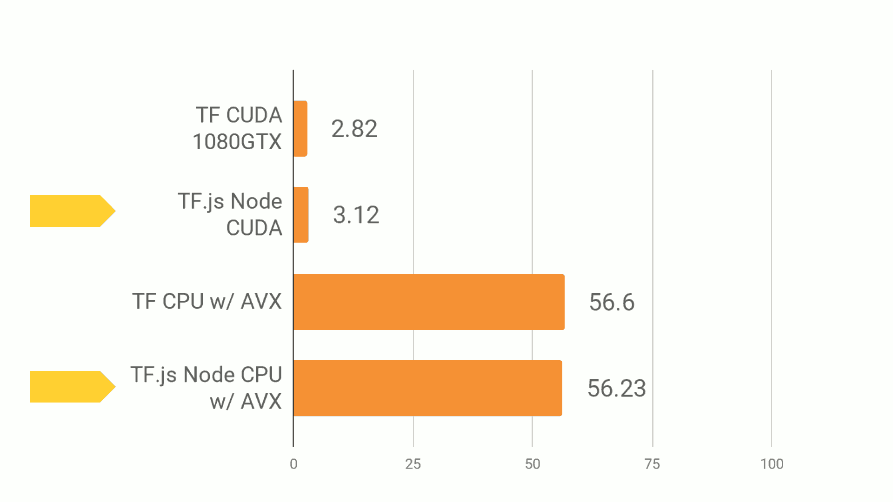

TensorFlow in JavaScript
=============================

    **Atwood’s Law**
     
    “Any application that can be written in JavaScript, will eventually be written in JavaScript.”
     
     -- Jeff Atwood, Founder of StackOverflow.com

    “JavaScript now works.”
     
     -- Paul Graham, YC Founder

Tensorflow.js 简介
^^^^^^^^^^^^^^^^^^^^^^^^^^^^^^^^^^^^^^^^^^^^

.. figure:: ../_static/image/javascript/tensorflow-js.gif
    :width: 60%
    :align: center

Tensorflow.js 是 Tensorflow 的 JavaScript 版本，支持GPU硬件加速，可以运行在 Node.js 或浏览器环境中。它不但支持完全基于 JavaScript 从头开发、训练和部署模型，也可以用来运行已有的 Python 版 Tensorflow 模型，或者基于现有的模型进行继续训练。

.. figure:: ../_static/image/javascript/architecture.gif
    :width: 60%
    :align: center

Tensorflow.js 支持 GPU 硬件加速。在 Node.js 环境中，如果有 CUDA 环境支持，或者在浏览器环境中，有 WebGL 环境支持，那么 Tensorflow.js 可以使用硬件进行加速。

本章，我们将基于 Tensorflow.js 1.0，向大家简单的介绍如何基于 ES6 的 JavaScript 进行 Tensorflow.js 的开发，然后提供两个例子，并基于例子进行详细的讲解和介绍，最终实现使用纯 JavaScript 进行 Tensorflow 模型的开发、训练和部署。

本章中提到的 JavaScript 版 Tensorflow 的相关代码，使用说明，和训练好的模型文件及参数，都可以在作者的 GitHub 上找到。地址： https://github.com/huan/javascript-concise-chitchat

在浏览器中使用 Tensorflow.js
^^^^^^^^^^^^^^^^^^^^^^^^^^^^^^^^^^^^^^^^^^^^

.. figure:: ../_static/image/javascript/chrome-ml.gif
    :width: 60%
    :align: center

Tensorflow.js可以让我们直接在浏览器中加载Tensorflow，让用户立即通过本地的CPU/GPU资源进行我们所需要的机器学习运算，更灵活的进行AI应用的开发。

浏览器中进行机器学习，相对比与服务器端来讲，将拥有以下四大优势：

* 不行要安装软件或驱动（打开浏览器即可使用）；
* 可以通过浏览器进行更加方便的人机交互；
* 可以通过手机浏览器，调用手机硬件的各种传感器（如：GPS、电子罗盘、加速度传感器、摄像头等）；
* 用户的数据可以无需上传到服务器，在本地即可完成所需操作。

通过这些优势，Tensorflow.js将带给开发者带来极高的灵活性。比如我们可以在手机上打开浏览器，通过手机摄像头检测视频中用户的身体动作姿势，然后通过对图片数据库中类似身体动作姿势的检索，给用户显示一个最能够和他当前动作相似的照片。这就是Google Creative Lab在2018年7月发布的Move Mirror。在Move Mirror的运行过程中，数据没有上传到服务器，所有的运算都是在手机本地，基于手机的CPU/GPU完成的，而这项技术，将使Servreless与AI应用结合起来成为可能。

.. figure:: ../_static/image/javascript/move-mirror.gif
    :width: 60%
    :align: center

Move Mirror 所使用的 PoseNet 地址：https://github.com/tensorflow/tfjs-models/tree/master/posenet

一个浏览器中的基本的线性回归模型
^^^^^^^^^^^^^^^^^^^^^^^^^^^^^^^^^^^^^^^^^^^^

在 Tensorflow 基础章节中，我们已经用 Python 实现过，针对某城市在2013年-2017年的房价的任务，通过对该数据进行线性回归，即使用线性模型 y = ax + b 来拟合上述数据，此处 a 和 b 是待求的参数。

下面我们改用 Tensorflow.js 来实现一个 JavaScript 版本。

首先，我们定义数据，进行基本的归一化操作。

.. code-block:: javascript

    import * as tf from '@tensorflow/tfjs'

    const xsRaw = tf.tensor([2013, 2014, 2015, 2016, 2017])
    const ysRaw = tf.tensor([12000, 14000, 15000, 16500, 17500])

    // 归一化
    const xs = xsRaw.sub(xsRaw.min())
                    .div(xsRaw.max().sub(xsRaw.min()))
    const ys = ysRaw.sub(ysRaw.min())
                    .div(ysRaw.max().sub(ysRaw.min()))

接下来，我们来求线性模型中两个参数 a 和 b 的值。

使用 `loss()` 计算损失；
使用 `optimizer.minimize()` 自动更新模型参数。

.. code-block:: javascript

    const a = tf.scalar(Math.random()).variable()
    const b = tf.scalar(Math.random()).variable()

    // y = a * x + b.
    const f = (x: tf.Tensor) => a.mul(x).add(b)
    const loss = (pred: tf.Tensor, label: tf.Tensor) => pred.sub(label).square().mean() as tf.Scalar

    const learningRate = 1e-3
    const optimizer = tf.train.sgd(learningRate)

    // 训练模型
    for (let i = 0; i < 10000; i++) {
       optimizer.minimize(() => loss(f(xs), ys))
    }

    // 预测
    console.log(`a: ${a.dataSync()}, b: ${b.dataSync()}`)
    const preds = f(xs).dataSync() as Float32Array
    const trues = ys.arraySync() as number[]
    preds.forEach((pred, i) => {
       console.log(`x: ${i}, pred: ${pred.toFixed(2)}, true: ${trues[i].toFixed(2)}`)
    })

从下面的输出样例中我们可以看到，已经拟合的比较接近了。

    a: 0.9339302778244019, b: 0.08108722418546677
    x: 0, pred: 0.08, true: 0.00
    x: 1, pred: 0.31, true: 0.36
    x: 2, pred: 0.55, true: 0.55
    x: 3, pred: 0.78, true: 0.82
    x: 4, pred: 1.02, true: 1.00

可以直接在浏览器中运行，完整的 HTML 代码如下：

.. code-block:: html

    <html>
      <head>
        
        
      </head>
    </html>

在服务器端使用 Tensorflow.js
^^^^^^^^^^^^^^^^^^^^^^^^^^^^^^^^^^^^^^^^^^^^

服务器端使用 JavaScript ，首先需要按照 [NodeJS.org](https://nodejs.org) 官网的说明，完成安装最新版本的 Node.js 。

然后，完成以下四个步骤即可完成配置：

1. 确认 Node.js 版本

    $ node --verion
    v10.5.0

    $ npm --version
    6.4.1

2. 建立 Tensorflow.js 项目目录

    $ mkdir tfjs
    $ cd tfjs

3. 安装 Tensorflow.js

    # 初始化项目管理文件 package.json
    $ npm init -y

    # 安装 tfjs 库，纯 JavaScript 版本
    $ npm install @tensorflow/tfjs 

    # 安装 tfjs-node 库，C Binding 版本
    $ npm install @tensorflow/tfjs-node 

    # 安装 tfjs-node-gpu 库，支持 CUDA GPU 加速
    $ npm install @tensorflow/tfjs-node-gpu

4. 确认 Node.js 和 Tensorflow.js 工作正常

    $ node
    > require('@tensorflow/tfjs').version
    { 'tfjs-core': '1.0.1',
      'tfjs-data': '1.0.1',
      'tfjs-layers': '1.0.1',
      'tfjs-converter': '1.0.1',
      tfjs: '1.0.1' }
    > 

如果你看到了上面的 `tfjs-core`, `tfjs-data`, `tfjs-layers` 和 `tfjs-converter` 的输出信息，那么就说明环境配置没有问题了。

通过 Tensorflow.js 加载 Python 模型
^^^^^^^^^^^^^^^^^^^^^^^^^^^^^^^^^^^^^^^^^^^^

一般Tensorflow的模型，以Python版本为例，会被存储为以下四种格式之一：

* TensorFlow SavedModel
* Frozen Model
* Tensorflow Hub Module
* Keras Module

所有以上四种格式，都可以通过 tensorflowjs-converter 转换器，将其转换为可以直接被 Tensorflow.js 加载的格式，在JavaScript语言中进行使用。

Tensorflow.js转换器tensorflowjs_converter
-------------------------------------------

`tensorflowjs_converter`可以将Python存储的模型格式，转换为JavaScript可以直接调用的模型格式。

安装`tensorflowjs_converter`：

    $ pip install tensorflowjs

`tensorflowjs_converter`的使用细节，可以通过`--help`参数查看程序帮助：

    $ tensorflowjs_converter --help

以下我们以MobilenetV1为例，看一下如何对模型文件进行转换操作，并将可以被Tensorflow.js加载的模型文件，存放到`/mobilenet/tfjs_model`目录下。

转换 SavedModel
-------------------------------------------

将`/mobilenet/saved_model`转换到`/mobilenet/tfjs_model`：

    tensorflowjs_converter \
        --input_format=tf_saved_model \
        --output_node_names='MobilenetV1/Predictions/Reshape_1' \
        --saved_model_tags=serve \
        /mobilenet/saved_model \
        /mobilenet/tfjs_model

转换 Frozen Model
-------------------------------------------

将`/mobilenet/frozen_model.pb`转换到`/mobilenet/tfjs_model`：

    tensorflowjs_converter \
        --input_format=tf_frozen_model \
        --output_node_names='MobilenetV1/Predictions/Reshape_1' \
        /mobilenet/frozen_model.pb \
        /mobilenet/tfjs_model

转换 Hub Model
-------------------------------------------

将`https://tfhub.dev/google/imagenet/mobilenet_v1_100_224/classification/1`转换到`/mobilenet/tfjs_model`：

    tensorflowjs_converter \
        --input_format=tf_hub \
        'https://tfhub.dev/google/imagenet/mobilenet_v1_100_224/classification/1' \
        /mobilenet/tfjs_model

转换 Keras Model
-------------------------------------------

将`/tmp/model.h5`转换到`/tmp/tfjs_model`：

    $ tensorflowjs_converter \
        --input_format keras \
        /tmp/model.h5 \
        /tmp/tfjs_model

用JavaScript加载和运行
-------------------------------------------

为了加载转换完成的模型文件，我们需要安装`tfjs-converter`和`@tensorflow/tfjs`模块：

    $ npm install @tensorflow/tfjs

然后，我们就可以通过JavaScript来加载Tensorflow模型了！

.. code-block:: javascript
    import * as tf from '@tensorflow/tfjs';

    const MODEL_URL = 'model_directory/model.json';

    const model = await tf.loadGraphModel(MODEL_URL);
    // 对Keras或者tfjs原生的层模型，使用下面的加载函数:
    // const model = await tf.loadLayersModel(MODEL_URL);

    const cat = document.getElementById('cat');
    model.execute(tf.browser.fromPixels(cat))

Tensorflow.js 性能对比
^^^^^^^^^^^^^^^^^^^^^^^^^^^^^^^^^^^^^^^^^^^^

Tensorflow.js的性能如何，Google官方做了一份基于 MobileNet 的评测，可以作为参考。具体评测是基于 MobileNet 的 Tensorflow 模型，将其 JavaScript 版本和 Python 版本各运行两百次。

其评测结论如下。

Python性能基准
------------------------------

Python代码运行一次推理：

1. 在CPU上需要时间为56.6ms
1. 在GPU上需要时间为2.82ms

我们将Python代码运行所需要的时间，设为基准1。

浏览器性能
------------------------------

在浏览器中，Tensorflow.js 可以使用 WebGL 进行硬件加速，将 GPU 资源使用起来。

.. figure:: ../_static/image/javascript/performance-browser.gif
    :width: 60%
    :align: center

Tensorflow.js在浏览器中运行一次推理：

1. 在CPU上需要时间为97.3ms
1. 在GPU(WebGL)上需要时间为10.8ms

与Python代码基准相比，浏览器中的 Tensorflow.js 在 CPU 上的运行时间为基准的1.7倍，在 GPU(WebGL) 上运行的时间为基准的3.8倍。

Node.js性能
------------------------------

在 Node.js 中，Tensorflow.js 使用 Tensorflow 的 C Binding ，所以基本上可以达到和 Python 接近的效果。

Tensorflow.js 在 Node.js 运行一次推理：

1. 在 CPU 上需要时间为56.23ms
1. 在 GPU(CUDA) 上需要时间为3.12ms

与 Python 代码基准相比，Node.js 的 Tensorflow.js 在 CPU 上的运行时间与基准相同，在 GPU（CUDA） 上运行的时间是基准的1.1倍。
