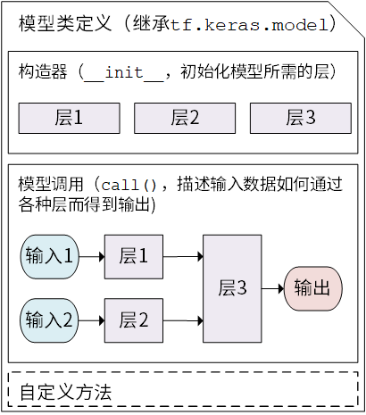
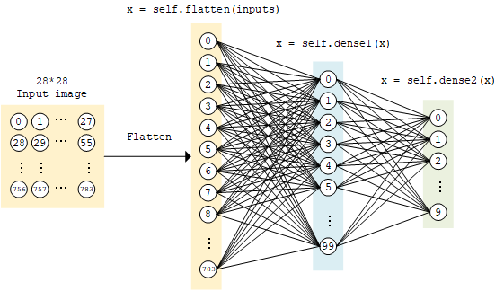

TensorFlow模型建立与训练
========================================

.. _linear:

本章介绍如何使用TensorFlow快速搭建动态模型。

.. admonition:: 前置知识
    
    * `Python面向对象编程 <http://www.runoob.com/python3/python3-class.html>`_ （在Python内定义类和方法、类的继承、构造和析构函数，`使用super()函数调用父类方法 <http://www.runoob.com/python/python-func-super.html>`_ ，`使用__call__()方法对实例进行调用 <https://www.liaoxuefeng.com/wiki/0014316089557264a6b348958f449949df42a6d3a2e542c000/0014319098638265527beb24f7840aa97de564ccc7f20f6000>`_ 等）；
    * 多层感知机、卷积神经网络、循环神经网络和强化学习（每节之前给出参考资料）。

模型（Model）与层（Layer）
^^^^^^^^^^^^^^^^^^^^^^^^^^^^^^^^^^^^^
..  https://www.tensorflow.org/programmers_guide/eager

在TensorFlow中，推荐使用Keras（ ``tf.keras`` ）构建模型。Keras是一个广为流行的高级神经网络API，简单、快速而不失灵活性，现已得到TensorFlow的官方内置和全面支持。

Keras有两个重要的概念： **模型（Model）** 和 **层（Layer）** 。层将各种计算流程和变量进行了封装（例如基本的全连接层，CNN的卷积层、池化层等），而模型则将各种层进行组织和连接，并封装成一个整体，描述了如何将输入数据通过各种层以及运算而得到输出。在需要模型调用的时候，使用 ``y_pred = model(X)`` 的形式即可。Keras在 ``tf.keras.layers`` 下内置了深度学习中大量常用的的预定义层，同时也允许我们自定义层。

Keras模型以类的形式呈现，我们可以通过继承 ``tf.keras.Model`` 这个Python类来定义自己的模型。在继承类中，我们需要重写 ``__init__()`` （构造函数，初始化）和 ``call(input)`` （模型调用）两个方法，同时也可以根据需要增加自定义的方法。

.. code-block:: python

    class MyModel(tf.keras.Model):
        def __init__(self):
            super().__init__()     # Python 2 下使用 super(MyModel, self).__init__()
            # 此处添加初始化代码（包含call方法中会用到的层），例如
            # layer1 = tf.keras.layers.BuiltInLayer(...)
            # layer2 = MyCustomLayer(...)

        def call(self, input):
            # 此处添加模型调用的代码（处理输入并返回输出），例如
            # x = layer1(input)
            # output = layer2(x)
            return output

        # 还可以添加自定义的方法

    Keras模型类定义示意图

继承 ``tf.keras.Model`` 后，我们同时可以使用父类的若干方法和属性，例如在实例化类 ``model = Model()`` 后，可以通过 ``model.variables`` 这一属性直接获得模型中的所有变量，免去我们一个个显式指定变量的麻烦。

上一章中简单的线性模型 ``y_pred = a * X + b`` ，我们可以通过模型类的方式编写如下：

.. literalinclude:: ../_static/code/zh/model/linear/linear.py

这里，我们没有显式地声明 ``a`` 和 ``b`` 两个变量并写出 ``y_pred = a * X + b`` 这一线性变换，而是建立了一个继承了 ``tf.keras.Model`` 的模型类 ``Linear`` 。这个类在初始化部分实例化了一个 **全连接层** （ ``tf.keras.layers.Dense`` ），并在call方法中对这个层进行调用，实现了线性变换的计算。如果需要显式地声明自己的变量并使用变量进行自定义运算，或者希望了解Keras层的内部原理，请参考 :ref:`自定义层 <custom_layer>`。

.. admonition:: Keras的全连接层：线性变换+激活函数

    `全连接层 <https://www.tensorflow.org/api_docs/python/tf/keras/layers/Dense>`_ （Fully-connected Layer，``tf.keras.layers.Dense`` ）是Keras中最基础和常用的层之一。给定输入张量 ``input = [batch_size, input_dim]`` ，该层对输入张量首先进行 ``tf.matmul(input, kernel) + bias`` 的线性变换，然后对线性变换后张量的每个元素通过激活函数 ``activation`` ，输出形状为 ``[batch_size, units]`` 的二维张量。
    
    .. figure:: ../_static/image/model/dense.png
        :width: 60%
        :align: center

    其包含的主要参数如下：
    
    * ``units`` ：输出张量的维度；
    * ``activation`` ：激活函数，默认为无激活函数（ ``a(x) = x`` ）。常用的激活函数包括 ``tf.nn.relu`` 、 ``tf.nn.tanh`` 和 ``tf.nn.sigmoid`` ；
    * ``use_bias`` ：是否加入偏置向量 ``bias`` 。默认为 ``True`` ；
    * ``kernel_initializer`` 、 ``bias_initializer`` ：权重矩阵 ``kernel`` 和偏置向量 ``bias`` 两个变量的初始化器。默认为 ``tf.glorot_uniform_initializer`` [#glorot]_ 。设置为 ``tf.zeros_initializer`` 表示将两个变量均初始化为全0；
    
    以及包含权重矩阵 ``kernel = [input_dim, units]`` 和偏置向量 ``bias = [units]`` [#broadcast]_ 两个变量，相当于上述的 ``a`` 和 ``b`` 。

    这里着重从数学矩阵运算和线性变换的角度描述了全连接层。基于神经元建模的描述可参考 :ref:`后文介绍 <neuron>` 。

    .. [#glorot] Keras中的很多层都默认使用 ``tf.glorot_uniform_initializer`` 初始化变量，关于该初始化器可参考 https://www.tensorflow.org/api_docs/python/tf/glorot_uniform_initializer 。
    .. [#broadcast] 你可能会注意到， ``tf.matmul(input, kernel)`` 的结果是一个形状为 ``[batch_size, units]`` 的二维矩阵，这个二维矩阵要如何与形状为 ``[units]`` 的一维偏置向量bias相加呢？事实上，这里是TensorFlow的Broadcasting机制在起作用，该加法运算相当于将二维矩阵的每一行加上了 ``Bias`` 。Broadcasting机制的具体介绍可见 https://www.tensorflow.org/xla/broadcasting 。

.. admonition:: 为什么模型类是重载 ``call()`` 方法而不是  ``__call__()`` 方法？

    在Python中，对类的实例 ``myClass`` 进行形如 ``myClass()`` 的调用等价于 ``myClass.__call__()`` （具体请见本章初“前置知识”的 ``__call__()`` 部分）。那么看起来，为了使用 ``y_pred = model(X)`` 的形式调用模型类，应该重写 ``__call__()`` 方法才对呀？原因是Keras在模型调用的前后还需要有一些自己的内部操作，所以暴露出一个专门用于重载的 ``call()`` 方法。 ``tf.keras.Model`` 这一父类已经包含 ``__call__()`` 的定义。 ``__call__()`` 中主要调用了 ``call()`` 方法，同时还需要在进行一些keras的内部操作。这里，我们通过继承 ``tf.keras.Model`` 并重载 ``call()`` 方法，即可在保持keras结构的同时加入模型调用的代码。

.. _mlp:

基础示例：多层感知机（MLP）
^^^^^^^^^^^^^^^^^^^^^^^^^^^^^^^^^^^^^^

我们从编写一个最简单的 `多层感知机 <https://zh.wikipedia.org/wiki/%E5%A4%9A%E5%B1%82%E6%84%9F%E7%9F%A5%E5%99%A8>`_ （Multilayer Perceptron, MLP），或者说“多层全连接神经网络”开始，介绍TensorFlow的模型编写方式。

.. admonition:: 基础知识和原理
    
    * UFLDL教程 `神经网络 <http://ufldl.stanford.edu/wiki/index.php/%E7%A5%9E%E7%BB%8F%E7%BD%91%E7%BB%9C>`_ 一节。
    * 斯坦福课程 `CS231n: Convolutional Neural Networks for Visual Recognition <http://cs231n.github.io/>`_ 中的“Neural Networks Part 1 ~ 3”部分。

这里，我们使用多层感知机完成MNIST手写体数字图片数据集 [LeCun1998]_ 的分类任务。

.. figure:: ../_static/image/model/mnist_0-9.png
    :align: center

    MNIST手写体数字图片示例

先进行预备工作，实现一个简单的 ``DataLoader`` 类来读取MNIST数据集数据。

.. literalinclude:: ../_static/code/zh/model/mlp/main.py
    :lines: 13-24

.. hint:: ``mnist = tf.keras.datasets.mnist`` 将从网络上自动下载MNIST数据集并加载。如果运行时出现网络连接错误，可以从 https://storage.googleapis.com/tensorflow/tf-keras-datasets/mnist.npz 或 https://s3.amazonaws.com/img-datasets/mnist.npz 下载MNIST数据集 ``mnist.npz`` 文件，并放置于用户目录的 ``.keras/dataset`` 目录下（Windows下用户目录为 ``C:\Users\用户名`` ，Linux下用户目录为 ``/home/用户名`` ）。

.. admonition:: TensorFlow的图像数据表示
    
    在TensorFlow中，图像数据集的一种典型表示是 ``[图像数目，长，宽，色彩通道数]`` 的四维张量。在上面的 ``DataLoader`` 类中， ``self.train_data`` 和 ``self.test_data`` 分别载入了60,000和10,000张大小为 ``28*28`` 的手写体数字图片。由于这里读入的是灰度图片，色彩通道数为1（彩色RGB图像色彩通道数为3），所以我们使用 ``np.expand_dims()`` 函数为图像数据手动在最后添加一维通道。

多层感知机的模型类实现与上面的线性模型类似，所不同的地方在于层数增加了（顾名思义，“多层”感知机），以及引入了非线性激活函数（这里使用了 `ReLU函数 <https://zh.wikipedia.org/wiki/%E7%BA%BF%E6%80%A7%E6%95%B4%E6%B5%81%E5%87%BD%E6%95%B0>`_ ， 即下方的 ``activation=tf.nn.relu`` ）。该模型输入一个向量（比如这里是拉直的 ``1×784`` 手写体数字图片），输出10维的信号，分别代表这张图片属于0到9的概率。这里我们加入了一个 ``predict`` 方法，对图片对应的数字进行预测。在预测的时候，选择概率最大的数字进行预测输出。

.. literalinclude:: ../_static/code/zh/model/mlp/mlp.py
    :lines: 4-19

    MLP模型示意图

定义一些模型超参数：

.. literalinclude:: ../_static/code/zh/model/mlp/main.py
    :lines: 8-10

实例化模型，数据读取类和优化器：

.. code-block:: python

    model = MLP()
    data_loader = DataLoader()
    optimizer = tf.train.AdamOptimizer(learning_rate=learning_rate)

然后迭代进行以下步骤：

- 从DataLoader中随机取一批训练数据；
- 将这批数据送入模型，计算出模型的预测值；
- 将模型预测值与真实值进行比较，计算损失函数（loss）；
- 计算损失函数关于模型变量的导数；
- 使用优化器更新模型参数以最小化损失函数。

具体代码实现如下：

.. literalinclude:: ../_static/code/zh/model/mlp/main.py
    :lines: 32-39

接下来，我们使用验证集测试模型性能。具体而言，比较验证集上模型预测的结果与真实结果，输出预测正确的样本数占总样本数的比例：

.. literalinclude:: ../_static/code/zh/model/mlp/main.py
    :lines: 41-43

输出结果::

    test accuracy: 0.947900

可以注意到，使用这样简单的模型，已经可以达到95%左右的准确率。

.. _neuron:

.. admonition:: 神经网络的基本单位：神经元 [#order]_

    如果我们将上面的神经网络放大来看，详细研究计算过程，比如取第二层的第k个计算单元，可以得到示意图如下：

    .. figure:: ../_static/image/model/neuron.png
        :width: 80%
        :align: center

    该计算单元 :math:`Q_k` 有100个权值参数 :math:`w_{0k}, w_{1k}, ..., w_{99k}` 和1个偏置参数 :math:`b_k` 。将第1层中所有的100个计算单元 :math:`P_0, P_1, ..., P_{99}` 的值作为输入，分别按权值 :math:`w_{ik}` 加和（即 :math:`\sum_{i=0}^{99} w_{ik} P_i` ），并加上偏置值 :math:`b_k` ，然后送入激活函数 :math:`f` 进行计算，即得到输出结果。

    事实上，这种结构和真实的神经细胞（神经元）类似。神经元由树突、胞体和轴突构成。树突接受其他神经元传来的信号作为输入（一个神经元可以有数千甚至上万树突），胞体对电位信号进行整合，而产生的信号则通过轴突传到神经末梢的突触，传播到下一个（或多个）神经元。

    .. figure:: ../_static/image/model/real_neuron.png
        :width: 80%
        :align: center

        神经细胞模式图（修改自 Quasar Jarosz at English Wikipedia [CC BY-SA 3.0 (https://creativecommons.org/licenses/by-sa/3.0)]）

    上面的计算单元，可以被视作对神经元结构的数学建模。在上面的例子里，第二层的每一个计算单元（人工神经元）有100个权值参数和1个偏置参数，而第二层计算单元的数目是10个，因此这一个全连接层的总参数量为100*10个权值参数和10个偏置参数。事实上，这正是该全连接层中的两个变量 ``kernel`` 和 ``bias`` 的形状。仔细研究一下，你会发现，这里基于神经元建模的介绍与上文基于矩阵计算的介绍是等价的。
    
    .. [#order] 事实上，应当是先有神经元建模的概念，再有基于人工神经元和层结构的人工神经网络。但由于本手册着重介绍TensorFlow的使用方法，所以调换了介绍顺序。

卷积神经网络（CNN）
^^^^^^^^^^^^^^^^^^^^^^^^^^^^^^^^^

`卷积神经网络 <https://zh.wikipedia.org/wiki/%E5%8D%B7%E7%A7%AF%E7%A5%9E%E7%BB%8F%E7%BD%91%E7%BB%9C>`_ （Convolutional Neural Network, CNN）是一种结构类似于人类或动物的 `视觉系统 <https://zh.wikipedia.org/wiki/%E8%A7%86%E8%A7%89%E7%B3%BB%E7%BB%9F>`_ 的人工神经网络，包含一个或多个卷积层（Convolutional Layer）、池化层（Pooling Layer）和全连接层（Fully-connected Layer）。

.. admonition:: 基础知识和原理
    
    * 台湾大学李宏毅教授的《机器学习》课程的 `Convolutional Neural Network <https://www.bilibili.com/video/av10590361/?p=21>`_ 一章。
    * 斯坦福课程 `CS231n: Convolutional Neural Networks for Visual Recognition <http://cs231n.github.io/>`_ 中的“Module 2: Convolutional Neural Networks”部分。

具体的实现见下，和MLP很类似，只是新加入了一些卷积层和池化层。

.. figure:: ../_static/image/model/cnn.png
    :align: center

    CNN结构图示

.. literalinclude:: ../_static/code/zh/model/cnn/cnn.py
    :lines: 4-38

将前节的 ``model = MLP()`` 更换成 ``model = CNN()`` ，输出如下::

    test accuracy: 0.988100

可以发现准确率有非常显著的提高。事实上，通过改变模型的网络结构（比如加入Dropout层防止过拟合），准确率还有进一步提升的空间。

.. admonition:: 卷积层和池化层的工作原理

    

循环神经网络（RNN）
^^^^^^^^^^^^^^^^^^^^^^^^^^^^^^^^^

循环神经网络（Recurrent Neural Network, RNN）是一种适宜于处理序列数据的神经网络，被广泛用于语言模型、文本生成、机器翻译等。

.. admonition:: 基础知识和原理
    
    - `Recurrent Neural Networks Tutorial, Part 1 – Introduction to RNNs <http://www.wildml.com/2015/09/recurrent-neural-networks-tutorial-part-1-introduction-to-rnns/>`_
    - 台湾大学李宏毅教授的《机器学习》课程的 `Recurrent Neural Network (part 1) <https://www.bilibili.com/video/av10590361/?p=36>`_ `Recurrent Neural Network (part 2) <https://www.bilibili.com/video/av10590361/?p=37>`_ 两部分。
    - LSTM原理：`Understanding LSTM Networks <https://colah.github.io/posts/2015-08-Understanding-LSTMs/>`_
    - RNN序列生成：[Graves2013]_

这里，我们使用RNN来进行尼采风格文本的自动生成。 [#rnn_reference]_

这个任务的本质其实预测一段英文文本的接续字母的概率分布。比如，我们有以下句子::

    I am a studen

这个句子（序列）一共有13个字符（包含空格）。当我们阅读到这个由13个字符组成的序列后，根据我们的经验，我们可以预测出下一个字符很大概率是“t”。我们希望建立这样一个模型，输入num_batch个由编码后字符组成的，长为seq_length的序列，输入张量形状为[num_batch, seq_length]，输出这些序列接续的下一个字符的概率分布，概率分布的维度为字符种类数num_chars，输出张量形状为[num_batch, num_chars]。我们从下一个字符的概率分布中采样作为预测值，然后滚雪球式地生成下两个字符，下三个字符等等，即可完成文本的生成任务。

首先，还是实现一个简单的 ``DataLoader`` 类来读取文本，并以字符为单位进行编码。

.. literalinclude:: ../_static/code/zh/model/rnn/rnn.py
    :lines: 31-49

接下来进行模型的实现。在 ``__init__`` 方法中我们实例化一个常用的 ``BasicLSTMCell`` 单元，以及一个线性变换用的全连接层，我们首先对序列进行One Hot操作，即将编码i变换为一个n维向量，其第i位为1，其余均为0。这里n为字符种类数num_char。变换后的序列张量形状为[num_batch, seq_length, num_chars]。接下来，我们将序列从头到尾依序送入RNN单元，即将当前时间t的RNN单元状态 ``state`` 和t时刻的序列 ``inputs[:, t, :]`` 送入RNN单元，得到当前时间的输出 ``output`` 和下一个时间t+1的RNN单元状态。取RNN单元最后一次的输出，通过全连接层变换到num_chars维，即作为模型的输出。

.. figure:: ../_static/image/model/rnn_single.jpg
    :width: 30%
    :align: center

    ``output, state = self.cell(inputs[:, t, :], state)`` 图示

.. figure:: ../_static/image/model/rnn.jpg
    :width: 50%
    :align: center

    RNN流程图示

具体实现如下：

.. literalinclude:: ../_static/code/zh/model/rnn/rnn.py
    :lines: 7-21

训练过程与前节基本一致，在此复述：

- 从DataLoader中随机取一批训练数据；
- 将这批数据送入模型，计算出模型的预测值；
- 将模型预测值与真实值进行比较，计算损失函数（loss）；
- 计算损失函数关于模型变量的导数；
- 使用优化器更新模型参数以最小化损失函数。

.. literalinclude:: ../_static/code/zh/model/rnn/rnn.py
    :lines: 59-69

关于文本生成的过程有一点需要特别注意。之前，我们一直使用 ``tf.argmax()`` 函数，将对应概率最大的值作为预测值。然而对于文本生成而言，这样的预测方式过于绝对，会使得生成的文本失去丰富性。于是，我们使用 ``np.random.choice()`` 函数按照生成的概率分布取样。这样，即使是对应概率较小的字符，也有机会被取样到。同时，我们加入一个 ``temperature`` 参数控制分布的形状，参数值越大则分布越平缓（最大值和最小值的差值越小），生成文本的丰富度越高；参数值越小则分布越陡峭，生成文本的丰富度越低。

.. literalinclude:: ../_static/code/zh/model/rnn/rnn.py
    :lines: 23-28

通过这种方式进行“滚雪球”式的连续预测，即可得到生成文本。

.. literalinclude:: ../_static/code/zh/model/rnn/rnn.py
    :lines: 71-78

生成的文本如下::

    diversity 0.200000:
    conserted and conseive to the conterned to it is a self--and seast and the selfes as a seast the expecience and and and the self--and the sered is a the enderself and the sersed and as a the concertion of the series of the self in the self--and the serse and and the seried enes and seast and the sense and the eadure to the self and the present and as a to the self--and the seligious and the enders
    
    diversity 0.500000:
    can is reast to as a seligut and the complesed
    has fool which the self as it is a the beasing and us immery and seese for entoured underself of the seless and the sired a mears and everyther to out every sone thes and reapres and seralise as a streed liees of the serse to pease the cersess of the selung the elie one of the were as we and man one were perser has persines and conceity of all self-el
    
    diversity 1.000000:
    entoles by
    their lisevers de weltaale, arh pesylmered, and so jejurted count have foursies as is
    descinty iamo; to semplization refold, we dancey or theicks-welf--atolitious on his
    such which
    here
    oth idey of pire master, ie gerw their endwit in ids, is an trees constenved mase commars is leed mad decemshime to the mor the elige. the fedies (byun their ope wopperfitious--antile and the it as the f
    
    diversity 1.200000:
    cain, elvotidue, madehoublesily
    inselfy!--ie the rads incults of to prusely le]enfes patuateded:.--a coud--theiritibaior "nrallysengleswout peessparify oonsgoscess teemind thenry ansken suprerial mus, cigitioum: 4reas. whouph: who
    eved
    arn inneves to sya" natorne. hag open reals whicame oderedte,[fingo is
    zisternethta simalfule dereeg hesls lang-lyes thas quiin turjentimy; periaspedey tomm--whach 

.. [#rnn_reference] 此处的任务及实现参考了 https://github.com/keras-team/keras/blob/master/examples/lstm_text_generation.py

深度强化学习（DRL）
^^^^^^^^^^^^^^^^^^^^^^^^^^^^^^^^^

`强化学习 <https://zh.wikipedia.org/wiki/%E5%BC%BA%E5%8C%96%E5%AD%A6%E4%B9%A0>`_ （Reinforcement learning，RL）强调如何基于环境而行动，以取得最大化的预期利益。结合了深度学习技术后的强化学习更是如虎添翼。这两年广为人知的AlphaGo即是深度强化学习的典型应用。

.. admonition:: 基础知识和原理

    - `Demystifying Deep Reinforcement Learning <https://ai.intel.com/demystifying-deep-reinforcement-learning/>`_ （`中文编译 <https://snowkylin.github.io/rl/2017/01/04/Reinforcement-Learning.html>`_）
    - [Mnih2013]_

这里，我们使用深度强化学习玩CartPole（平衡杆）游戏。简单说，我们需要让模型控制杆的左右运动，以让其一直保持竖直平衡状态。

.. only:: html

    .. figure:: ../_static/image/model/cartpole.gif
        :width: 500
        :align: center

        CartPole游戏

.. only:: latex

    .. figure:: ../_static/image/model/cartpole.png
        :width: 500
        :align: center

        CartPole游戏

我们使用 `OpenAI推出的Gym环境库 <https://gym.openai.com/>`_ 中的CartPole游戏环境，具体安装步骤和教程可参考 `官方文档 <https://gym.openai.com/docs/>`_ 和 `这里 <https://morvanzhou.github.io/tutorials/machine-learning/reinforcement-learning/4-4-gym/>`_ 。Gym的基本调用方法如下：

.. code-block:: python

    import gym
    
    env = gym.make('CartPole-v1')       # 实例化一个游戏环境，参数为游戏名称
    state = env.reset()                 # 初始化环境，获得初始状态
    while True:
        env.render()                    # 对当前帧进行渲染，绘图到屏幕
        action = model.predict(state)   # 假设我们有一个训练好的模型，能够通过当前状态预测出这时应该进行的动作
        next_state, reward, done, info = env.step(action)   # 让环境执行动作，获得执行完动作的下一个状态，动作的奖励，游戏是否已结束以及额外信息
        if done:                        # 如果游戏结束则退出循环
            break

那么，我们的任务就是训练出一个模型，能够根据当前的状态预测出应该进行的一个好的动作。粗略地说，一个好的动作应当能够最大化整个游戏过程中获得的奖励之和，这也是强化学习的目标。

以下代码展示了如何使用深度强化学习中的Deep Q-Learning方法来训练模型。

.. literalinclude:: ../_static/code/zh/model/rl/rl.py

对于不同的任务（或者说环境），我们需要根据任务的特点，设计不同的状态以及采取合适的网络来拟合Q函数。例如，如果我们考虑经典的打砖块游戏（Gym环境库中的  `Breakout-v0 <https://gym.openai.com/envs/Breakout-v0/>`_  ），每一次执行动作（挡板向左、向右或不动），都会返回一个 ``210 * 160 * 3`` 的RGB图片，表示当前屏幕画面。为了给打砖块游戏这个任务设计合适的状态表示，我们有以下分析：

* 砖块的颜色信息并不是很重要，画面转换成灰度也不影响操作，因此可以去除状态中的颜色信息（即将图片转为灰度表示）；
* 小球移动的信息很重要，如果只知道单帧画面而不知道小球往哪边运动，即使是人也很难判断挡板应当移动的方向。因此，必须在状态中加入表征小球运动方向的信息。一个简单的方式是将当前帧与前面几帧的画面进行叠加，得到一个 ``210 * 160 * X`` （X为叠加帧数）的状态表示；
* 每帧的分辨率不需要特别高，只要能大致表征方块、小球和挡板的位置以做出决策即可，因此对于每帧的长宽可做适当压缩。

而考虑到我们需要从图像信息中提取特征，使用CNN作为拟合Q函数的网络将更为适合。

.. _custom_layer:

自定义层 *
^^^^^^^^^^^^^^^^^^^^^^^^^^^^^^^^^

可能你还会问，如果现有的这些层无法满足我的要求，我需要定义自己的层怎么办？

事实上，我们不仅可以继承 ``tf.keras.Model`` 编写自己的模型类，也可以继承 ``tf.keras.layers.Layer`` 编写自己的层。

.. code-block:: python

    class MyLayer(tf.keras.layers.Layer):
        def __init__(self):
            super().__init__()
            # 初始化代码

        def build(self, input_shape):     # input_shape 是一个 TensorShape 类型对象，提供输入的形状
            # 在第一次使用该层的时候调用该部分代码，在这里创建变量可以使得变量的形状自适应输入的形状
            # 而不需要使用者额外指定变量形状。
            # 如果已经可以完全确定变量的形状，也可以在__init__部分创建变量
            self.variable_0 = self.add_variable(...)
            self.variable_1 = self.add_variable(...)

        def call(self, input):
            # 模型调用的代码（处理输入并返回输出）
            return output

例如，如果我们要自己实现一个 :ref:`本章第一节 <linear>` 中的全连接层，但指定输出维度为1，可以按如下方式编写，在 ``build`` 方法中创建两个变量，并在 ``call`` 方法中使用创建的变量进行运算：

.. literalinclude:: ../_static/code/zh/model/custom_layer/linear.py
    :lines: 9-21
    
使用相同的方式，可以调用我们自定义的层 ``LinearLayer``：

.. literalinclude:: ../_static/code/zh/model/custom_layer/linear.py
    :lines: 24-31

Graph Execution模式 *
^^^^^^^^^^^^^^^^^^^^^^^^^^^^^^^^^

在TensorFlow 2.0中，推荐使用 ``@tf.function`` （而非1.X中的Session）实现Graph Execution。

事实上，只要在编写模型的时候稍加注意，以上的模型都是可以同时兼容Eager Execution模式和Graph Execution模式的 [#rnn_exception]_ 。注意，在Graph Execution模式下， ``model(input_tensor)`` 只需运行一次以完成图的建立操作。

例如，通过以下代码，同样可以调用 :ref:`本章第一节 <linear>` 建立的线性模型并进行线性回归：

.. literalinclude:: ../_static/code/zh/model/custom_layer/linear.py
    :lines: 48-59

.. [#rnn_exception] 除了本章实现的RNN模型以外。在RNN模型的实现中，我们通过Eager Execution动态获取了seq_length的长度，使得我们可以方便地动态控制RNN的展开长度。然而Graph Execution不支持这一点，为了达到相同的效果，我们需要固定seq_length的长度，或者使用 ``tf.nn.dynamic_rnn`` （ `文档 <https://www.tensorflow.org/api_docs/python/tf/nn/dynamic_rnn>`_ ）。

Keras Pipeline *
^^^^^^^^^^^^^^^^^^^^^^^^^^^^^^^^^

序列到序列模型（Sequence to Sequence, SEQ2SEQ）是一种基于RNN的Encoder-Decoder结构，它也是现在谷歌应用于线上机器翻译的算法，翻译质量已经和人类水平不相上下。

这里通过Keras Sequential模式建立一个闲聊对话机器人（SEQ2SEQ）。它使用Encoder-Decoder结构，简单的来说就是算法包含两部分，一个负责对输入的信息进行Encoding，将输入转换为向量形式；然后由Decoder对这个向量进行解码，还原为输出序列。

关于SEQ2SEQ的原理，可以参考：

- To be added
- To be added

这里，我们使用SEQ2SEQ来实现一个闲聊（Chit Chat）对话机器人。除了闲聊机器人（输入一句话，输出一句回复）之外，它也可以被直接应用于解决其他类似问题，比如：翻译（输入一句英文，输出一句中文）、摘要（输入一篇文章，输出一份总结）、作诗（输入几个关键字，输出一首短诗）、对对联（输入上联，输出下联），等等。

这个任务对比与之前的RNN尼采风格文本生成，区别在于我们预测的不再是文本的连续字母概率分布，而是通过一个序列，来预测另外一个对应的完整序列。举例来说，针对一句常见的打招呼::

    How are you

这个句子（序列）一共有3个单词。当我们听到这个由3个单词组成的句子后，根据我们的习惯，我们最倾向与回复的一句话是"Fine thank you"。我们希望建立这样的模型，输入num_batch个由编码后单词和字符组成的，长为max_length的序列，输入张量形状为[num_batch, max_length]，输出与这个序列对应的序列（如聊天回复、翻译等）中单词和字符的概率分布，概率分布的维度为词汇表大小voc_size，输出张量形状为[num_batch, max_length, voc_size]。

首先，还是实现一个简单的 ``DataLoader`` 类来读取文本，

.. code-block:: python

    DATASET_URL = 'https://github.com/huan/concise-chit-chat/releases/download/v0.0.1/dataset.txt.gz'
    DATASET_FILE_NAME = 'concise-chit-chat-dataset.txt.gz'
    LATENT_UNIT_NUM = 100
    EMBEDDING_DIM = 50
    MAX_LEN = 20
    DONE = '\a'
    GO = '\b'

    class DataLoader():
        def __init__(self) -> None:
            dataset_file = tf.keras.utils.get_file(DATASET_FILE_NAME, origin=DATASET_URL)
            with gzip.open(dataset_file, 'rt') as f:
                self.raw_text = f.read().lower()
            self.queries, self.responses = self.__parse_raw_text(self.raw_text)
            self.size = len(self.queries)

        def get_batch(self, batch_size=32):
            batch_indices = np.random.choice(self.size, size=batch_size)
            return self.queries[batch_indices], self.responses[batch_indices]

        def preprocess(self, text):
            text = re.sub('[^a-zA-Z0-9 .,?!]', ' ', text)
            text = re.sub(' +', ' ', text)
            text = re.sub('([\w]+)([,;.?!#&-\'\"-]+)([\w]+)?', r'\1 \2 \3', text)
            if len(text.split()) > MAX_LEN:
                text = (' ').join(text.split()[:MAX_LEN])
                match = re.search('[.?!]', text)
                if match is not None:
                    idx = match.start()
                    text = text[:idx+1]
            return text.strip().lower()

        def __parse_raw_text(self, raw_text):
            query_list, response_list = [], []
            for line in raw_text.strip('\n').split('\n'):
                query, response = line.split('\t')
                query, response = self.preprocess(query), self.preprocess(response)
                query_list.append('{} {} {}'.format(GO, query, DONE))
                response_list.append('{} {} {}'.format(GO, response, DONE))
            return np.array(query_list), np.array(response_list)

其次，我们还需要基于 `DataLoader` 加载的文本数据，建立一个词汇表 `Vocabulary` 来负责管理以下5项任务：

1. 将所有单词和标点符号进行编码；
2. 记录词汇表大小；
3. 建立单词到编码数字，以及编码数字到单词的映射字典；
4. 负责将文本句子转化为填充后的编码序列，形状为[batch_size, max_length]；

.. code-block:: python

    class Vocabulary:
        def __init__(self, text):
            self.tokenizer = tf.keras.preprocessing.text.Tokenizer(filters='')
            self.tokenizer.fit_on_texts([GO, DONE] + re.split(r'[\s\t\n]', text))
            self.size = 1 + len(self.tokenizer.word_index.keys())

        def texts_to_padded_sequences(self, text_list):
            sequence_list = self.tokenizer.texts_to_sequences(text_list)
            padded_sequences = tf.keras.preprocessing.sequence.pad_sequences(
                sequence_list, maxlen=MAX_LEN, padding='post', truncating='post')
            return padded_sequences

接下来进行模型的实现。我们建立一个ChitChat模型，在 `__init__` 方法中我们将 `Vocabulary` 中的词汇到编码字典 `word_index` 和编码到词汇字典 `index_word` ，以及词汇量 `voc_size` 保存备用，实例化一个常用的 `Embedding` 单元，以及一个 `Encoder` 子模型和对应的 `Decoder` 子模型。子模型中需要使用Embedding单元、代表序列开始的GO字符编码，以及词汇表尺寸，我们通过构造参数传给它们。我们首先对序列进行Encoder操作，即将编码序列 `inputs` 变换为一个上下文向量 `context` ，然后再对其进行Decoder操作，得到输出编码序列张量，即作为模型的输出。变换后的序列张量形状为[num_batch, max_length, voc_size]。

`ChitChat` 模型具体实现如下：

.. code-block:: python

    class ChitChat(tf.keras.Model):
        def __init__(self, vocabulary):
            super().__init__()
            self.word_index = vocabulary.tokenizer.word_index
            self.index_word = vocabulary.tokenizer.index_word
            self.voc_size = vocabulary.size

            self.embedding = tf.keras.layers.Embedding(
                input_dim=self.voc_size, output_dim=EMBEDDING_DIM, mask_zero=True)
            self.encoder = ChitEncoder(embedding=self.embedding)
            self.decoder = ChatDecoder(embedding=self.embedding,
                indice_go=self.word_index[GO], voc_size=self.voc_size)

        def call(self, inputs, teacher_forcing_targets=None, training=None):
            context = self.encoder(inputs)
            return self.decoder(inputs=context, training=training,
                teacher_forcing_targets=teacher_forcing_targets)

ChitEncoder子模型输入num_batch个由编码后单词和字符组成的，长为max_length的序列，输入张量形状为[num_batch, max_length]，输出与这个序列对应的上下文张量。为了简化代码，我们这里只使用一个最基本的LSTM单元，没有使用可以获得更佳效果的双向RNN、注意力机制等方法。在 `__init__` 方法中我们实例化一个常用的 `LSTM` 单元，并将其设置为 `return_state=True` 来获得最终的状态输出，我们首先对序列进行LSTM操作，即将编码序列变换为LSTM最终输出的状态 ，并将其作为代表编码序列的上下文信息 `context` ，作为模型的输出。

`ChitEncoder` 子模型具体实现如下：

.. code-block:: python

    class ChitEncoder(tf.keras.Model):
        def __init__(self):
            super().__init__()
            self.lstm_encoder = tf.keras.layers.LSTM(
            units=LATENT_UNIT_NUM, return_state=True)

        def call(self, inputs):
            _, *context = self.lstm_encoder(inputs)
            return context

ChatDecoder子模型输入num_batch个上下文信息张量 `context` 。在 `__init__` 方法中我们保存 `embedding` 单元，序列起始标志GO字符的编码 `indice_go` 和词汇表容量 `voc_size` ，实例化一个常用的 `LSTM` 单元，并将其设置为输出单元状态 `return_state=True` 来获得LSTM的状态输出，以及一个全连接层 `Dense` 单元，负责将LSTM的输出变换为最终的单词字符分布概率，并将其作为这个上下文信息对应的单词符号序列概率分布张量，作为模型的输出，形状为[num_batch, max_length, voc_size]。

`ChitEncoder` 子模型具体实现如下：

.. code-block:: python

    class ChatDecoder(tf.keras.Model):
        def __init__(self, embedding, voc_size, indice_go):
            super().__init__()

            self.embedding = embedding
            self.indice_go = indice_go
            self.voc_size = voc_size

            self.lstm_decoder = tf.keras.layers.LSTM(
                units=LATENT_UNIT_NUM, return_state=True)
            self.dense = tf.keras.layers.Dense(units=voc_size)

        def call(self, inputs, teacher_forcing_targets=None, training=False):
            batch_size = tf.shape(inputs[0])[0]
            batch_go_one_hot = tf.ones([batch_size, 1, 1]) \
                * [tf.one_hot(self.indice_go, self.voc_size)]

            outputs = tf.zeros([batch_size, 0, self.voc_size])
            output = batch_go_one_hot
            states = inputs

            for t in range(0, MAX_LEN):
                if training:
                    target_indice = tf.expand_dims(
                        teacher_forcing_targets[:, t], axis=-1)
                else:
                    target_indice = tf.argmax(output, axis=-1)

                decoder_inputs = self.embedding(target_indice)
                output, *states = self.lstm_decoder(
                    inputs=decoder_inputs, initial_state=states)
                output = self.dense(output)
                outputs = tf.concat([outputs, output], 1)

            return outputs

训练过程与前节基本一致，在此复述：

- 从DataLoader中随机取一批训练数据；
- 将这批数据送入模型，计算出模型的预测值；
- 将模型预测值与真实值进行比较，计算损失函数（loss）；
- 计算损失函数关于模型变量的导数；
- 使用优化器更新模型参数以最小化损失函数。

.. code-block:: python

    def loss(model, x, y) -> tf.Tensor:
        weights = tf.cast(tf.not_equal(y, 0), tf.float32)
        prediction = model(inputs=x, teacher_forcing_targets=y, training=True)
        return tf.contrib.seq2seq.sequence_loss(
            prediction, tf.convert_to_tensor(y), weights)

    def grad(model, inputs, targets):
        with tf.GradientTape() as tape:
            loss_value = loss(model, inputs, targets)
        return tape.gradient(loss_value, model.variables)

    learning_rate = 1e-2
    num_batches = 8000
    batch_size = 256

    data_loader = DataLoader()
    vocabulary = Vocabulary(data_loader.raw_text)
    chitchat = ChitChat(vocabulary=vocabulary)
    optimizer = tf.train.AdamOptimizer(learning_rate=learning_rate)

    for batch_index in range(num_batches):
        queries, responses = data_loader.get_batch(batch_size)

        queries_sequences = vocabulary.texts_to_padded_sequences(queries)
        responses_sequences = vocabulary.texts_to_padded_sequences(responses)

        grads = grad(chitchat, queries_sequences, responses_sequences)
        optimizer.apply_gradients(grads_and_vars=zip(grads, chitchat.variables))

        print("step %d: loss %f" % (batch_index,
            loss(chitchat, queries_sequences, responses_sequences).numpy())

训练大约需要…… （时间、step数）::

    step 0: loss 8.019347
    step 10: loss 5.006745
    step 20: loss 4.798050
    step 30: loss 4.728132
    step 40: loss 3.921826

训练loss到小于…… 的时候，可以使用：

最后，我们需要一个用来对话的程序，来测试实际效果：

给 ChitChat 增加 predict 方法：

.. code-block:: python

    class ChitChat(tf.keras.Model):
        # ... append the following code to previous code
        def predict(self, inputs, temperature=1.):
            inputs = np.expand_dims(inputs, 0)
            outputs = tf.squeeze(self(inputs))

            response_indices = []
            for t in range(1, MAX_LEN):
                output = outputs[t]
                indice = self.__logit_to_indice(output, temperature=temperature)
                if indice == self.word_index[DONE]:
                    break
                response_indices.append(indice)
            return response_indices

        def __logit_to_indice(self, inputs, temperature=1.):
            inputs = tf.squeeze(inputs)
            prob = tf.nn.softmax(inputs / temperature).numpy()
            indice = np.random.choice(self.voc_size, p=prob)
            return indice

Chat 程序……

具体实现如下：

.. code-block:: python

    data_loader = DataLoader()
    vocabulary = Vocabulary(data_loader.raw_text)

    chitchat = ChitChat(vocabulary)
    checkpoint = tf.train.Checkpoint(model=chitchat)

    checkpoint.restore(tf.train.latest_checkpoint('./checkpoints'))

    index_word = vocabulary.tokenizer.index_word
    word_index = vocabulary.tokenizer.word_index

    while True:
        try:
            query = input('> ').lower()
            if query == 'q' or query == 'quit':
                break
            query = data_loader.preprocess(query)
            query = '{} {} {}'.format(GO, query, DONE)

            query_sequence = vocabulary.texts_to_padded_sequences([query])[0]
            response_sequence = chitchat.predict(query_sequence, temperature=0.5)

            response_word_list = [
                index_word[indice]
                for indice in response_sequence
                if indice != 0 and indice != word_index[DONE]
            ]

            print('Bot:', ' '.join(response_word_list))

        except KeyError:
            print("OOV: Please use simple words with the ChitChat Bot!")

生成的对话如下::

    > hi
    Bot:
    > hello
    Bot:
    > faint
    Bot:

https://medium.com/tensorflow/what-are-symbolic-and-imperative-apis-in-tensorflow-2-0-dfccecb01021

以上示例使用了Keras的Subclassing API建立模型。

Keras Sequential API模式建立模型
-------------------------------------------

在很多时候，我们只需要建立一个结构相对简单和典型、各个层之间仅顺序相连的神经网络（比如上文中的MLP和CNN）。这时，Keras给我们提供了一种更为简单的模型建立方式。

Keras Functional API模式建立模型
-------------------------------------------

https://www.tensorflow.org/alpha/guide/keras/functional

使用Keras Model的 ``compile`` 、 ``fit`` 和 ``evaluate`` 方法训练和评估模型
--------------------------------------------------------------------------------------

自定义Metrics和Loss
-------------------------------------------

.. [LeCun1998] Y. LeCun, L. Bottou, Y. Bengio, and P. Haffner. "Gradient-based learning applied to document recognition." Proceedings of the IEEE, 86(11):2278-2324, November 1998. http://yann.lecun.com/exdb/mnist/
.. [Graves2013] Graves, Alex. “Generating Sequences With Recurrent Neural Networks.” ArXiv:1308.0850 [Cs], August 4, 2013. http://arxiv.org/abs/1308.0850.
.. [Mnih2013] Mnih, Volodymyr, Koray Kavukcuoglu, David Silver, Alex Graves, Ioannis Antonoglou, Daan Wierstra, and Martin Riedmiller. “Playing Atari with Deep Reinforcement Learning.” ArXiv:1312.5602 [Cs], December 19, 2013. http://arxiv.org/abs/1312.5602.

